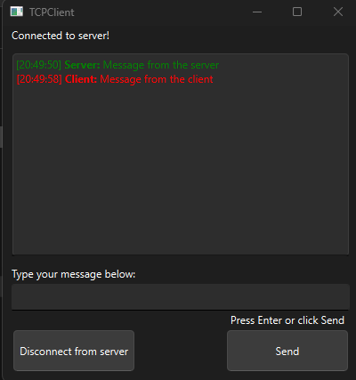

# TCPClient - Chat Client Application (Qt)

This is a simple TCP chat client application built using Qt. The client connects to a TCP chat server and facilitates a basic chat system where both the client and server can exchange messages in real time.

## Features
- Connect to the server with the click of a button.
- Real-time message exchange between the client and the server.
- Timestamps are added to each message for easy tracking.
- Messages are color-coded for easier identification:
  - **Blue** for client messages.
  - **Green** for server messages.
- Instructional labels guide users on where to type their messages and how to send them (press Enter or click Send).
- Client connects to the server on a specified IP address and port (default: port `1234`).

## Screenshot



## Steps to Create a Windows Executable (`.exe`)

1. **Set up the Environment:**
   - Ensure you have Qt installed and have configured your development environment.
   - Locate the path where `windeployqt.exe` is installed on your system. This can typically be found in the Qt installation folder under the `bin` directory.

2. **Add Path to System Variables:**
   - Add the path to `windeployqt.exe` in your system's environment variables. This will allow you to use the `windeployqt` tool from the command line easily.
   - Steps:
     - Open **Start Menu** and search for **Environment Variables**.
     - Click on **Edit the system environment variables**.
     - In the **System Properties** window, click on the **Environment Variables** button.
     - Under **System Variables**, find the **Path** variable, select it, and click **Edit**.
     - Click **New** and add the path to `windeployqt.exe` (e.g., `C:\Qt\Tools\QtCreator\bin\`).
     - Click **OK** to save the changes.

3. **Open Command Prompt (CMD):**
   - Open a command prompt window by searching for `cmd` in the Start menu.

4. **Navigate to the Release Directory:**
   - Use the `cd` command to navigate to the directory where the `.exe` release of your application is located. This is typically the `release` folder within the `build` directory. For example:
     ```bash
     cd C:\Qt\Projects\TCPClient\build\Desktop_Qt_6_7_3_MinGW_64_bit-Release\release
     ```

5. **Run the `windeployqt` Command:**
   - Once inside the release directory, run the following command:
     ```bash
     windeployqt TCPClient.exe
     ```
   - This command will bundle all the necessary Qt libraries and dependencies required for the application to run on another Windows machine.

6. **Distribute the Executable:**
   - After running the `windeployqt` command, you will find a set of additional files (DLLs, etc.) inside your release directory along with your `.exe` file. These files must be distributed together with the executable.

7. **Testing the Executable:**
   - Copy the entire contents of the release directory (including the `.exe` file and all linked libraries) to another Windows machine and test it to ensure everything works correctly.

